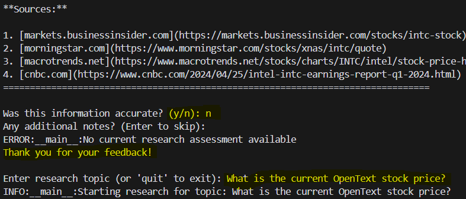
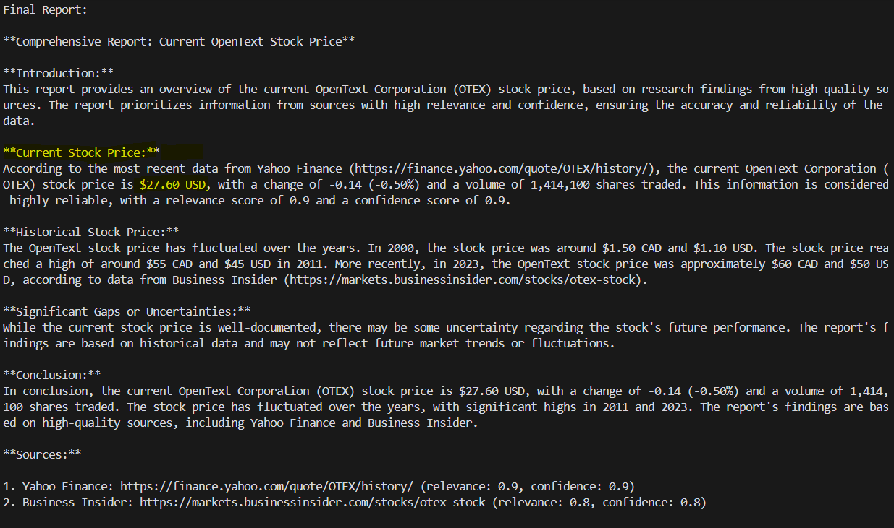

# Web Capable Research Assistant with Langchain

This script provides a console-based research assistant that can retrieve and analyze web content using a chosen language model (Ollama or Groq) and generate comprehensive reports on a given research topic in a specific format.

## Features

- Automated browsing with Selenium to capture web screenshots.
- Vision model integration to interpret webpage screenshots dynamically.
- Automated searching using Brave Search (requires an API key).
- Assessment and extraction of key information from returned content.
- Memory and feedback system to improve source reliability and content quality over time (avoid bad web sources).


## Use cases

- Research a topic, and provide a report in markdown format. Tested queries include:
    - "What is the current price of X stock?"
    - "What is the current price of X crypto?"
    - "What is the latest version of X software?"
    - "What is the latest news on X?"
    - "What is the answer to X?"


## Requirements

- Python
- A running Ollama Endpoint or Groq API key (depending on chosen model provider). 
- Firefox browser and [geckodriver](https://github.com/mozilla/geckodriver/releases) for Selenium.
- Brave Search API key
- If using Ollama, download llama3.2-3b, and llama3.2-vision 11b (or change the model in the code)
- Patience. This agent uses memory to improve its search results in a given subject area over time, initially it tends to get a lot of low quality sources, before it learns to avoid them. 

## Example:
After running the script, you will be asked to select Groq or Ollama. Then, to enter a query. 

- As you can see, it didn't work well at first, but after providing feedback, it will improve and work better, learning to avoid bad sources.
- Query: What is current price of OpenText stock? 

- Feedback: Here, we can see it got an answer, and provided two sources. Let's se if it's correct..

- It's correct, up to date. Verified by a human. 

## Setup

1. Install required dependencies:

   ```bash
   pip install -r requirements.txt
